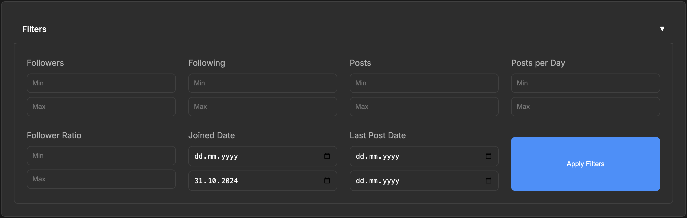
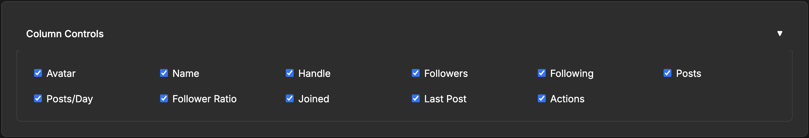

<div align="center">
  
  
  # SkyWatch
  
  BlueSky Follower Analytics & Management
  
  [](https://www.typescriptlang.org/)
  [](https://nodejs.org/)
  [](https://www.mongodb.com/)
</div>

## Features

### Powerful Filtering
Filter your followers based on various criteria to gain insights into your audience:



### Customizable Columns
Control which information you want to see with flexible column controls:



### Detailed User Table
View comprehensive information about your followers in an organized table:


Additional features include:
- Track and analyze your BlueSky followers
- View detailed statistics and metrics
- Filter and sort followers by various criteria
- Manage your following list
- Real-time import progress tracking
- Dark mode interface

## Prerequisites

- Node.js (v14 or higher)
- MongoDB
- BlueSky account

### MongoDB Setup

1. Install MongoDB Community Edition:
   - **macOS** (using Homebrew):
     ```bash
     brew tap mongodb/brew
     brew install mongodb-community
     ```
   - **Windows**:
     - Download the MongoDB Community Server from the [official website](https://www.mongodb.com/try/download/community)
     - Run the installer and follow the installation wizard
     - Optionally install MongoDB Compass (the GUI tool) when prompted

2. Start MongoDB service:
   - **macOS**:
     ```bash
     brew services start mongodb-community
     ```
   - **Windows**:
     - MongoDB should run automatically as a Windows Service
     - If not, you can start it manually:
       1. Open Services (Win + R, type 'services.msc')
       2. Find "MongoDB Server"
       3. Right-click and select "Start"

3. Verify installation:
   ```bash
   # Connect to MongoDB shell
   mongosh
   
   # If you see a '>' prompt, MongoDB is running correctly
   # Type 'exit' to leave the shell
   ```

4. Database Configuration:
   - The application will automatically create the required database ('bsky-follower-tracker')
   - Default connection string in .env file should work out of the box:
     ```
     MONGODB_URI="mongodb://localhost:27017/bsky-follower-tracker"
     ```
   - No additional database setup or user creation is required for local development

### Rate Limits

SkyWatch respects BlueSky's API rate limits:
- 5,000 requests per 5 minutes (16.7 req/sec)
- 50,000 requests per hour

For each of these, you can set a configurable percentage of the rate limit to use (0.0 to 1.0), whatever you feel is appropriate for your usage.

For each follower import, we make 2 API calls:
1. Fetch their profile information
2. Get their latest post timestamp

The import process automatically handles rate limiting by:
- Tracking API usage
- Respecting rate limit headers from BlueSky
- Pausing when limits are reached
- Automatically resuming when the rate limit window resets

## Setup

1. Clone the repository:
```bash
git clone https://github.com/gxjansen/SkyWatch
cd SkyWatch
```

2. Install dependencies:
```bash
npm install
```

3. Configure environment variables:
```bash
# Copy the example environment file
cp .env.example .env

# Edit .env with your credentials
nano .env
```

Required environment variables:
- `BLUESKY_HANDLE`: Your BlueSky handle (e.g., "username.bsky.social")
- `BLUESKY_PASSWORD`: Your BlueSky password
- `MONGODB_URI`: MongoDB connection string
- `PORT`: Server port (default: 3000)
- `AUTO_IMPORT`: Enable automatic follower import on startup (true/false)

Optional rate limit configuration:
- `RATE_LIMIT_AUTH`: Percentage of auth rate limit to use (0.0 to 1.0, default: 1.0)
- `RATE_LIMIT_FOLLOWS`: Percentage of follows/profile rate limit to use (0.0 to 1.0, default: 1.0)
- `RATE_LIMIT_UNFOLLOW`: Percentage of unfollow rate limit to use (0.0 to 1.0, default: 1.0)
- `RATE_LIMIT_GENERAL`: Percentage of general API rate limit to use (0.0 to 1.0, default: 1.0)

[Rest of the README content...]

4. Build the project:
```bash
npm run build
```

5. Start the server:
```bash
npm run server
```

The application will be available at `http://localhost:3000` (or your configured PORT).

## Development

Start the development server with:
```bash
# Regular start
npm run server

# Force re-import of followers
npm run server:force
```

This will:
- Watch for file changes
- Automatically restart the server
- Enable development logging
- Kill any existing processes on the port (using kill-port.sh)

## Available Commands

- `npm run server`: Start development server with auto-reload
- `npm run server:force`: Start server and force re-import of followers
- `npm run build`: Build the TypeScript project
- `npm start`: Start the core application (without web interface)
- `npm run start:server`: Start the production server
- `npm run kill-port`: Kill any processes running on the configured port

## Security Notes

- Never commit your `.env` file
- Keep your BlueSky credentials secure
- Use environment variables for all sensitive data

## Contributing

1. Fork the repository
2. Create your feature branch (`git checkout -b feature/amazing-feature`)
3. Commit your changes (`git commit -m 'Add amazing feature'`)
4. Push to the branch (`git push origin feature/amazing-feature`)
5. Open a Pull Request

## License

This project is licensed under the ISC License.
